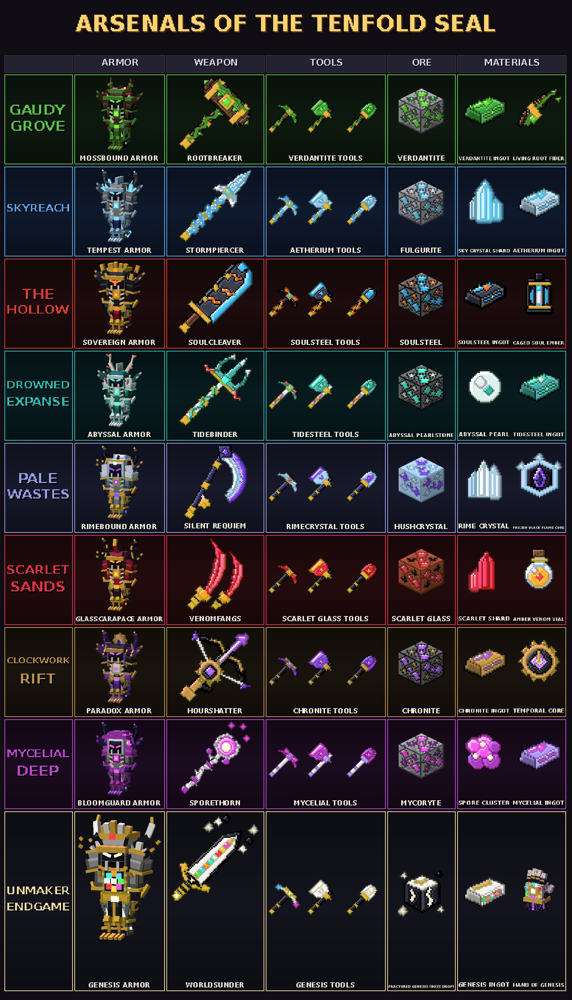

# Aurelia: The Shattered Crown (Forge 1.20.1)

Eight realms, eight Wardens, one broken crown, and the thing that broke it. Built for Ascendra (Forge 1.20.1); depends on nothing except Forge.

**Act one** (the Grove, Skyreach, the Hollow) reforges the Crown of Aurelia. **Act two** (the Drowned Expanse, the Pale Wastes, the Scarlet Sands) fills its three empty settings and ends with the **Ascendant Crown**. **Act three** (the Clockwork Rift, the Mycelial Deep) ends with the **Eternal Crown**. **The finale** gathers a relic from every Warden, opens the Convergence Gate, and pits you against the **Unmaker** in the Last Realm. Each act has its own section below.

## The shape of it

Aurelia was a kingdom of three realms bound by one crown. The Sovereign vanished, the crown broke, and each realm's Warden went wrong guarding its shard.

You find each realm's way in inside an **independent Citadel** out in the overworld. Fight your way through the guards, solve the citadel's puzzle to wake its portal, then beat the realm's Warden. Beat all three to reforge the **Crown of Aurelia**.

| Citadel | Portal to | Where it generates | Puzzle |
|---|---|---|---|
| **Rootbound Citadel**: a castle grown into a giant tree | The Gaudy Grove | forest biomes | **Plant four Spore Hearts** in four planters |
| **Stormwatch Citadel**: quartz spires on a rock crag | Skyreach | mountain biomes | **Lure Storm Wisps** so their lightning charges three pylons |
| **Ashen Citadel**: a fortress in a lava cavern, underground | The Hollow | badlands, desert, savanna, taiga, swamp | **Place twelve Soul Sigils** in twelve sockets |

Find one with `/locate structure aurelia:rootbound_citadel` (also `aurelia:stormwatch_citadel`, `aurelia:ashen_citadel`).

## The citadels

### Rootbound (65 x 65 x 76)
A giant dark-oak tree with a leafy canopy, branches, shelf mushrooms and roots running into the ground. A mossy outer wall with a south gate, four mushroom-capped towers on the diagonals, and a path to an arched entrance into the trunk. Inside the trunk is the portal hall: four **Spore Planters** around a glowing froglight circuit, the portal in a lime-glass alcove, and a lectern with lore.
- **Guards (14):** 4 Bramble Sentinels, 6 Sporecaps, 4 Rootstalkers.
- **Puzzle supply:** every Sporecap drops a Spore Heart, and each of the four towers holds a chest with 2 spare hearts, so it is solvable without killing anything.

### Stormwatch (65 x 65 x 92)
A rock crag topped with a quartz plaza, an octagon storm-sigil inlay, a tall central spire, four satellite spires joined by arched bridges, lightning rods on every tip, and waterfalls off the crag. The portal room is at the base of the central spire: three **Storm Pylons** wired to the portal by a copper circuit.
- **Guards (13):** 4 Calcite Sentinels, 5 Storm Wisps, 4 Gale Talons.
- **Puzzle:** a Storm Wisp's lightning charges every pylon within 4 blocks of the strike. Lure a wisp into the room and stand beside a pylon when it fires. Pylons stay charged.

### Ashen (81 x 81 x 76)
A huge cavern carved under the surface and lined with blackstone, with a lava lake, magma pillars and a basalt plateau holding a keep with four spired towers. A crater shaft opens to the surface, with a spiral ramp winding down its walls to a landing and a causeway across the lava. The portal hall has a recessed pit ringed by twelve **Soul Sockets**, the portal in a crying-obsidian alcove, soul-fire pillars and four chests.
- **Guards (12):** 4 Ashbound Knights, 4 Soul Jailers, 4 Cinder Hounds.
- **Puzzle supply:** Soul Jailers drop Soul Sigils, and each of the four hall chests holds 3, so 12 are guaranteed without a single kill.

All three have a lectern in the portal room with lore. Puzzle blocks, portals and altars are unbreakable in survival so nobody can soft-lock a citadel (creative can still remove them).

## The guards

| | Heavy | Special | Fast |
|---|---|---|---|
| **Rootbound** | **Bramble Sentinel** (90 HP): thorns hurt melee attackers, hard to knock back | **Sporecap** (34 HP): keeps its distance, throws poison spore clouds, heals nearby guards | **Rootstalker** (40 HP): pounces from range, its bite roots you |
| **Stormwatch** | **Calcite Sentinel** (100 HP): shield cuts frontal damage by 60%, flank it | **Storm Wisp** (30 HP): floats overhead, telegraphed lightning | **Gale Talon** (30 HP): circles, then dives with heavy knockback |
| **Ashen** | **Ashbound Knight** (110 HP): fire immune, greatsword ignites you | **Soul Jailer** (60 HP): chains you in place (slowness, weakness), calls Shades | **Cinder Hound** (50 HP): pounces, fiery bite |

## The Wardens (three phases each, at 66% and 33% health)

The Wardens were redesigned to be frightening. Each is a hierarchical model of 185 to 253 parts.

- **Mossback** (2500 HP): a hunched rot-wood horror with a deer-skull head, burning eye sockets, a jaw that hangs and works, a huge thorned antler rack hung with moss and skull trophies, an open ribcage around a beating glowing heart, broken branches jutting from its back, and arms long enough for its hooked claws to drag on the ground.
  **Gimmick: Root Hearts.** He plants 3 (4 in phase 3) around the arena. While any stands he heals 1.2% per heart per second and takes only 30% damage. Break them.
- **Tempest Roc** (3000 HP, flies): a storm-black raptor in a horned bone mask with white burning eyes, a snapping beak with a glowing throat, bone spikes down its spine and along the leading edge of each wing, wrist claws, two-jointed talons, a ragged nine-feather tail with two bone blades, and crackling sparks.
  **Gimmick: crash and stun.** Half damage in the air. A dive that misses leaves it stunned on the ground for about 3.5 seconds with the damage caps raised 2.5x. From phase 2 it throws gusts.
- **The Hollow King** (4000 HP): a towering dead king with a skull face in an open helm, a moving jaw, forward-curving horns, iron crown spikes with burning tips, skull-faced pauldrons with long spikes, bone ribs over black plate around a pulsing core, a spiked fur collar, a nine-strip torn cape, a soul orb in his left hand, a burning serrated greatsword taller than he is, six soul shards orbiting his chest, and a broken iron halo.
  **Gimmick: Annihilation.** He channels for 5 seconds. Deal 6% of his health in that window to stagger him (caps doubled for 5 seconds); fail and everyone within 28 blocks loses 60% of their max health.

Menace effects shared by all three:
- **Glow**: eyes, hearts, runes, soul fire and lava cracks are drawn at full brightness, so they shine in the dark (all nine guards get this too).
- **The sky darkens and fog rolls in** while a Warden's health bar is on screen (the same effect the Wither uses).
- **A heartbeat** sounds while he has a target, faster in the final phase.
- **Dread pulse**: at each phase change he roars, nearby players are blinded by Darkness for 5 seconds and thrown back.
- Hearts and cores visibly pulse; jaws and beaks open and close.

Damage limits: one hit removes at most 2% of a Warden's health and total damage is capped at 4% per second (`HIT_CAP`, `SECOND_CAP` in `AureliaBoss`). Stun and stagger windows raise those caps.

## Progression

1. **Rootbound Citadel**: plant four Spore Hearts, then right-click the portal. In the Grove, crouch and touch the altar to wake Mossback.
2. Mossback drops a **Grove Shard**. The **Stormwatch** portal will only open for someone **holding a Grove Shard**.
3. The Roc drops a **Storm Shard**. The **Ashen** portal needs a **Storm Shard** in hand.
4. The King drops a **Void Shard**. **Crown of Aurelia** = 3 shards + Block of Verdant Shards + Block of Stormglass + Block of Emberheart.

The Crown (helmet, never breaks) gives creative-style flight, Regeneration, Resistance, Night Vision, Water Breathing, toughness 4 and some knockback resistance.

## Citadel gimmicks

Each citadel has three layers: a **sealed door**, a **floor mechanism**, and the **portal puzzle** inside.

| Citadel | Seal (touch it to check) | Floor mechanism | Portal puzzle |
|---|---|---|---|
| Rootbound | **Bramble Seal** across the trunk entrance. Falls when all 4 Bramble Sentinels are dead. | **Spore Vents** on the path: poison and slowness when stepped on. | Plant four Spore Hearts. |
| Stormwatch | **Storm Seal** across the spire door. Falls when all 4 Calcite Sentinels are dead. | **Gale Plates** on the plaza: launch you about 20 blocks up with slow falling. Two bridges hold loot caches you can only reach this way. | Lure Wisp lightning onto three pylons. |
| Ashen | **Ash Seal** across the keep door. Falls when all 4 Ashbound Knights are dead. | **Ember Vents** on the causeway: fire and damage when stepped on. | Place twelve Soul Sigils. |

A seal counts its guardians within 48 blocks. Touching it tells you how many remain.

### Citadel architecture

**Rootbound**: a timber wall-walk on log brackets inside the curtain wall, reached by ladders and by doors from each tower; buttresses and arrow slits; a gatehouse with two roofed turrets and banners; three furnished floors in every tower (barrels, bookshelves, hay, lanterns) joined by a ladder; a lamp-lit path under root arches; a ring path, lily pond, fenced berry garden and an idol of the Warden in the courtyard; a carved door frame on the trunk with two glowing eyes above it; glow-berry vines and bee nests in the canopy; three roofed lookout platforms off the terrace; mushroom huts; weathered and cracked stonework.

**Stormwatch**: weathered copper roofs with bright bands on all five spires; arches under the four bridges with end-rod lamps; stained glass rings up the central spire; buttress fins and a balcony ring; a plaza with lamp posts, two reflecting pools lit from below, two winged statues, a fountain, hedges and flower beds; three tethered islets with pavilions; amethyst veins in the crag; a ring of floating rune stones; angel wings over the gate.

**Ashen**: stepped buttress piers and glowing furnace windows on every keep wall; a chiseled gate frame with fang spikes and hanging lanterns; battlement spikes; pyramid roofs and hanging soul lanterns on the towers; skulls on pikes, bone piles and basalt columns across the plateau; a colonnade of lantern pillars; inside the hall, two rows of columns, lava glowing under glass along the walls, banners, vaulted ribs, and a throne of crying obsidian against the east wall.

## Outposts, ores and materials

Each realm has two kinds of randomly generated outpost, each with guards and a loot chest:

- **Grove**
  - **Watchtower camp**: a spiked log palisade with a gatehouse, a cross-braced tower with a windowed cabin and stepped roof on top, two tents, a campfire with seats, log piles, barrels, an archery target, a grindstone, an iron cage. Guards: Bramble Sentinel, 2 Rootstalkers, Sporecap.
  - **Sporecap hamlet**: a great mushroom hall with a seven-block cap, four huts joined to it by paths, a roofed well, a fenced berry garden, a market stall with a striped awning, lamp posts, wild giant mushrooms. Guards: 4 Sporecaps, Rootstalker, Bramble Sentinel.
- **Skyreach**
  - **Watch island**: a three-floor quartz tower with a ladder, stained glass, a balcony ring, banners, a conical copper roof and lightning rod; a lamp-lit quartz path; a gale plate; broken pillars. The chest is on the top floor. Guards: Calcite Sentinel, 2 Storm Wisps.
  - **Wind shrine**: eight pillars joined by a lintel ring hung with bells, a three-tier dais with candles, and a crystal floating above the chest. Guards: 2 Gale Talons, Storm Wisp.
- **Hollow**
  - **Ashen fort**: a curtain wall with a wall-walk and battlements, a gate with banners, four round turrets with fire on top, a three-floor keep with furnace windows (chest on the roof), a forge with a lava cauldron, prison cages, sunken lava pools, skull pikes. Guards: Ashbound Knight, 2 Cinder Hounds, Soul Jailer.
  - **Soul shrine**: eight obsidian pillars with lantern arms, a stepped altar with candles, a ring of soul sand with wither roses and soul fire, a gate arch, skull pikes. Guards: 2 Soul Jailers, Cinder Hound.

Other realm structures gained detail too: two new Grove ruins (a **tower stump** with a broken stair and a **fallen colonnade**), a pillared **temple on every ziggurat summit** with corner obelisks and skull pikes, and **hanging lanterns and gate arches** on the Hollow bridges.

Each realm has its own ore (iron pickaxe or better, Fortune works, Silk Touch drops the ore block):

| Ore | Where | Drops | Storage block |
|---|---|---|---|
| Verdant Ore | Grove stone, pillar faces | Verdant Shard | Block of Verdant Shards |
| Stormglass Ore | The rock of every Skyreach island (glows faintly) | Stormglass Shard | Block of Stormglass (light source) |
| Emberheart Ore | Hollow blackstone and basalt, stalactites, rock plugs | Emberheart | Block of Emberheart (light source) |

Outpost chests hold 3 to 7 of their realm's material. **The Crown recipe changed**: it is now the three shards plus one storage block of each material (9 of each), so exploring all three realms is part of the goal.

## The realms

Each realm combines vanilla terrain generation with structures and features the mod adds.

**The Gaudy Grove**: amplified terrain (towering hills) covered in moss, jungle forest and giant mushrooms. On top of that, the mod adds:
- **Forested stone pillars** (4 variants, 40 to 70+ blocks tall): flared mesa tops with a pond, a waterfall that spills down the face, jungle trees, mushrooms, flowers and ferns, vine curtains, and mossy boulders at the foot.
- **Mossy ruins** (3 variants): a broken stone arch, pillars, a wall and stair, overgrown with vines and flowers.
- **Cliff waterfalls and vine curtains** everywhere (custom spring and vine features), jungle mega-trees, large ferns, flower fields, drifting spores, permanent noon.

**Skyreach**: a true void world. The islands are structures:
- **Floating islands** in four sizes (3 small, 3 medium, 2 large, 1 spired castle island) at random heights between y=30 and y=170. Each has a calcite cone underside with hanging spikes, a grass top with white and pink blossom trees, flowers, ferns and tall grass, hanging vines, and satellite rocks.
- Medium and large islands have **a pond and a waterfall** that spills off the edge. Large islands carry a **ruined quartz tower**. The castle island has a **spire cluster** and a quartz plaza.
- Sparkling air, phantoms and Sky Sentinels.

**The Hollow**: a closed Nether-style cavern under a black ceiling, with basalt floors, soul-soil drifts, lava lakes, falling ash, and:
- **Ziggurats** (2 variants, 4 to 5 tiers) on lava-island plugs, with stairs on every side, braziers, crimson fungi, a lava pool and a crying-obsidian altar at the top.
- **Arched bridges** (2 variants, 34 to 40 blocks) on broad piers, with railings and soul-fire posts.
- **Hanging stalactites** (5 variants, 24 to 46 blocks) fixed to the bedrock ceiling, with glowstone nodules.
- **Giant red fungi** on basalt, **lava falls** (custom springs), soul-fire patches and glowstone clusters.

## Detailing pass (every structure)

`tools/enrich.py` runs on every template as it is saved, so all 90 structures share it. The average template went from 18.6 to 26.5 block types; the big citadels from about 40 to about 60.
- **Weathering.** Plain masonry and stone are mixed with their cracked, mossy, chiseled and neighbouring variants.
- **Architecture.**
  - Quoins on convex wall corners.
  - Lintels and sills round every window.
  - Inlaid borders where room floors meet walls.
  - Capitals and bases on free-standing pillars.
- **Furniture** in the corners of roofed rooms, chosen per realm: barrels, bookshelves, smithing tables, lodestones, decorated pots, candles, potted plants, skulls.
- **Realm dressing:**
  - ivy and moss in the Grove;
  - snow on every open ledge in the Pale Wastes;
  - glow lichen and hanging roots in the deep places;
  - lanterns on chains from high ceilings;
  - cobwebs in upper corners;
  - realm-coloured banners on tall walls;
  - flowers and mushrooms in the grass.

It never touches the mod's own blocks or anything within two blocks of them, and never decorates a guard's cell or anything in or beside water. It never blocks the Sunscar beam, and keeps furniture out of passage bends. The reachability checks still pass for every citadel and the Last Realm.

# Arsenals of the Tenfold Seal

Every realm has a full arsenal: a four-piece armor set worn as its own 3D model, a signature weapon, a pickaxe, axe and shovel, an ore and two materials. Every realm also has a passive creature and a food. The Unmaker's Genesis arsenal sits above them all.

| Armor | Weapon | Tools | Ore | Materials | Creature / food |
|---|---|---|---|---|---|
| Mossbound | Rootbreaker (warhammer) | Verdantite | Verdantite Ore | Verdantite Ingot, Living Root Fiber | Mossling / Verdant Fig |
| Tempest | Stormpiercer (spear) | Aetherium | Fulgurite Ore | Aetherium Ingot, Sky Crystal Shard | Cloud Ray / Sky Jelly |
| Sovereign | Soulcleaver (cleaver) | Soulsteel | Soulsteel Ore | Soulsteel Ingot, Caged Soul Ember | Ember Beetle / Charred Morsel |
| Abyssal | Tidebinder (trident) | Tidesteel | Abyssal Pearlstone | Tidesteel Ingot, Abyssal Pearl | Lantern Jelly / Glowing Gel |
| Rimebound | Silent Requiem (scythe) | Rimecrystal | Hushcrystal Ore | Rime Crystal, Frozen Black-Flame Core | Frost Hare / Frost Hare Haunch |
| Glasscarapace | Venomfangs (twin daggers) | Scarlet Glass | Scarlet Glass Ore | Scarlet Shard, Amber Venom Vial | Sand Skink / Sunbaked Tail |
| Paradox | Hourshatter (repeating crossbow) | Chronite | Chronite Ore | Chronite Ingot, Temporal Core | Cogling / Tickberry |
| Bloomguard | Sporethorn (staff) | Mycelial | Mycoryte Ore | Mycelial Ingot, Spore Cluster | Spore Puff / Puffcap |
| Genesis | Worldsunder (greatsword) | Genesis | Fractured Genesis (Unmaker drop) | Genesis Ingot, Hand of Genesis | |

**Ores and materials.** Each realm's ore keeps its old id, so worldgen and every structure that places it are unchanged.
- Each ore drops a raw material.
- Raw Verdantite, Raw Soulsteel and Raw Chronite smelt (or blast) into ingots.
- Aetherium is two Sky Crystal Shards and a gold ingot. Tidesteel is two Abyssal Pearls and an iron ingot. Mycelial Ingots are two Spore Clusters and an iron ingot.
- The Pale Wastes and the Scarlet Sands work their crystals as they are (Rime Crystal, Scarlet Shard).
- Living Root Fiber is two vines and a Raw Verdantite.
- The cores are four of the realm's metal round a catalyst: Caged Soul Ember (a soul lantern), Frozen Black-Flame Core (a soul campfire), Amber Venom Vial (a honey bottle), Temporal Core (a clock).

**Crafting.**
- Armor and tools use the realm's metal in the usual shapes.
- A weapon is three metal, the realm's second material and a stick.
- Three Fractured Genesis fall with every Unmaker kill. One Fractured Genesis with an ingot of each realm's metal round it makes four Genesis Ingots, which make the Genesis armor and tools.
- Worldsunder is a Fractured Genesis with all eight realm weapons round it.

**Art.** Every sprite is drawn by `tools/arsenal_art.py` on `tools/pixelart.py`, a small pixel-art engine. It draws shapes with no antialiasing, shades each one (light top-left, shade bottom-right, cast shadows) with hue-shifted ramps, and adds a dark outline and soft glow halos.
- Weapons are 64 x 64 and held about 1.5x larger than a sword. The display transforms are computed so the grip stays in the hand (`gen_arsenal.held_big`).
- Tools, materials and armor icons are 32 x 32. Ores are 16 x 16.

**Worn armor** (`tools/gen_armor.py`) is solid fitted plate with layered pauldrons, a distinctive helm per set and clean bevelled textures. Every set is built to look menacing. Its plate is darkened so the trim and glow burn out of it, and every set shares these features:
- a dark visor with slanted, burning eyes and a fanged jaw guard;
- great curling horns on the helm and a ridge of spines over the crown;
- pauldrons bristling with long spikes;
- a bone ribcage over the breast, with glowing cracks through the plate;
- a spined back, collar spikes and a long tattered cape;
- clawed gauntlets with forearm blades;
- chains at the belt, and spiked knees and thighs;
- clawed, spurred boots.

On top of that, each set has its own helm:
- a moss-and-branch helm with glowing eyes;
- ice-crystal wings and spikes;
- a gold crown with horns and a T visor;
- bone-and-coral antlers;
- a frost hood with gold bells;
- a scarab horn with glass wings;
- a gear crest with a clock breastplate;
- a mushroom-cap hood;
- Genesis's horned crown, the eight realm stones round a star, and gold-edged pauldrons.

Full-set powers, each with a particle aura:

- **Mossbound:** Regeneration II; poison cannot touch you; anyone who strikes you takes 4 damage and is rooted. Green spores drift round you.
- **Tempest:** Jump Boost III, Speed I, no fall damage; a third of those who strike you are struck by lightning. Sparks crackle round you.
- **Sovereign:** Fire Resistance and Strength I; anyone who strikes you burns for 6 seconds. Embers rise off you.
- **Abyssal:** Water Breathing; Dolphin's Grace, Conduit Power and Regeneration in water or rain. Bubbles stream off you.
- **Rimebound:** Immune to freezing, walk on powder snow, Resistance I; water freezes under your feet; anyone who strikes you is frozen. Snow falls round you.
- **Glasscarapace:** By day Haste II and Strength II, by night Night Vision; a third of arrows and projectiles glance off you. Sunlight glints round you.
- **Paradox:** Speed II and Haste II. Borrowed Time: a killing blow throws you back to where you stood five seconds ago at half health instead (once every 90 s).
- **Bloomguard:** Night Vision; poison and wither cannot touch you; it feeds you when hungry; allies near you regenerate; anyone who strikes you is poisoned.

Weapons, each with an on-hit power and a right-click special on a cooldown:

- **Rootbreaker** (warhammer): on hit, roots the target (Slowness III), poisons it, and heals you a heart. Use: Bramble Eruption: thorns tear up through the ground in a line ahead (10 damage, rooted). 8 s.
- **Stormpiercer** (spear): on hit, throws the target into the air with a crack of thunder. Use: Tempest Dash: you are flung eight blocks forward and lightning strikes everything you pass (12 damage). 6 s.
- **Soulcleaver** (cleaver): on hit, sets the target on fire and withers it. Use: Soul Inferno: a ring of soul fire bursts out round you (14 damage, burning, thrown back). 10 s.
- **Tidebinder** (trident): on hit, drags the target toward you; half again as hard in water. Use: Maelstrom: every enemy within 12 blocks is dragged to you and half-drowned (8 damage, slowed). 10 s.
- **Silent Requiem** (scythe): on hit, freezes the target; strikes twice as hard from a crouch. Use: Whiteout Step: you vanish and reappear behind whatever you are looking at, striking it (18 damage, frozen). 6 s.
- **Venomfangs** (twin daggers): on hit, very fast. Poisons the target, and half the blow cuts everything else within reach. Use: Fang Flurry: you whirl through everything within 6 blocks (16 damage, Poison II). 8 s.
- **Hourshatter** (repeating crossbow): on hit, its bladed limbs slow and weaken whatever they cut. Use: Hour Volley: fires five chronite bolts in a fan; whatever they hit is frozen in time for 4 seconds. 3 s.
- **Sporethorn** (staff): on hit, poisons and sickens the target and everything near it. Use: Bloom Burst: a cloud of spores bursts out (Poison III, nausea) and you heal for every enemy it catches. 10 s.

**Genesis** is tuned above everything else in the mod, and above the usual endgame of a pack like Ascendra. I could not open Ascendra's mod list from here, so the comparison is with netherite (8 damage; 20 armor, 12 toughness) and the top weapons of the usual endgame boss mods (roughly 12 to 16 damage).
- **Genesis armor:** 30 armor and 20 toughness for the set (both the game's caps), full knockback immunity, +5 max health per piece, 66x durability.
- **Genesis full-set powers:**
  - Strength II, Resistance I, Fire Resistance, Night Vision, Water Breathing; poison, wither, freezing and falling cannot touch you.
  - Event Horizon: no single blow can take more than 30% of your health, and half of all arrows and projectiles are swallowed.
  - Eightfold Retaliation: whatever strikes you takes 6 damage and one realm's curse: rooted, struck, burned, dragged, frozen, cut, slowed or poisoned.
  - The Last Heart: a killing blow leaves you at half health instead, with Absorption IV and a shockwave that throws back and hurts everything near you (once every 2 minutes).
  - Crouch in mid-air to drift down slowly.
- **Worldsunder:** 24 attack damage, 1.0 speed, 1.5 blocks of extra reach.
  - Unmaking: every hit also deals 3% of the target's max health (up to 15 more), and carries the next of the eight realm powers in turn: root, storm, fire, tide, frost, sweep, time, spores.
  - Singularity: a black hole opens six blocks ahead, drags in everything within twelve blocks, then collapses (30 damage, Wither II, slowed). 20 s.
- **Genesis tools:** mine 33% faster than the realm tools.

**Creatures** spawn in their realm. They wander, follow anyone holding their food, breed on it and drop it. The Cloud Ray and Spore Puff fly; the Lantern Jelly swims.

**Regenerating:** run `gen_realm_kit.py` (foods, creatures, ore blocks), then `gen_arsenal.py` (all arsenal art, models, names, recipes), then `gen_armor.py` (worn armor). `arsenal_sheet.py out.jpg` draws the sheet above.

Known risk: the weapon hand poses are computed from vanilla's handheld transforms but have not been seen in game. If a weapon sits oddly, adjust `held_big` in `tools/gen_arsenal.py`.

# Act two: the outer realms

The Crown of Aurelia comes back with three empty settings. Crafting it points you at the sea; a second book, *The Outer Chronicle*, waits on the first outer realm you reach.

| Citadel | Portal to | Where it generates | Opens for | The rite |
|---|---|---|---|---|
| **Tidewrack Citadel**: a drowned sea-fortress on a reef | The Drowned Expanse | ocean, lukewarm, warm and cold ocean (not deep) | the **Crown of Aurelia**, held or worn | **Ring five Tide Bells as the tide rises** |
| **Rimefast Citadel**: a hushed abbey in the snow | The Pale Wastes | snowy plains, snowy taiga, ice spikes, snowy slopes, grove | **Leviathan's Pearl** | **Crouch, perfectly still, on four Hush Stones** |
| **Sunscar Citadel**: a stepped sun temple | The Scarlet Sands | desert and badlands | **Frozen Tear** | **Turn the Sun Mirrors so the Sunwell's beam lights three lenses** |

`/locate structure aurelia:tidewrack_citadel` (also `aurelia:rimefast_citadel`, `aurelia:sunscar_citadel`).

A crown counts as every relic that went into it: the Crown of Aurelia opens every act one portal and the Drowned Expanse, and the Ascendant Crown opens all six. Finished realms can always be revisited.

## The rites

- **Tide Bells (Tidewrack).** Down a spiral stair under the keep, in a dry vault under the reef, five bells stand on pedestals 0 to 4 blocks tall, shuffled round the room. Ring them from the floor bell to the tallest; each voice is higher than the last. A bell rung out of turn silences them all, and the sea surges (slowness, mining fatigue, 4 damage). The lecterns give the rule.
- **Hush Stones (Rimefast).** Four stones in the chapel aisles. Crouch on one and stay perfectly still for five seconds; the action bar counts it. Standing up, moving, or taking a hit restarts it. The Hushwraiths shriek at anyone moving upright (darkness, and the whole garrison gets speed and strength), so clear the chapel or be very careful.
- **Sun Mirrors (Sunscar).** The court is open to the sky. The Sunwell fires north only while the sun is up (right-click it or any mirror to fire). Each of the eight mirrors turns the beam 90 degrees; right-clicking one flips it between `/` and `\`. Lenses let the beam through and stay lit. Lighting the three lenses takes 3, 5 and 5 flips from the starting layout; a solver checks this every time the citadel is generated. `previews/16_sunscar_mirror_court.png` shows the court from above.

Each citadel also has a seal and a floor trap, like act one:

| Citadel | Seal (falls when its guardians are dead) | Floor trap |
|---|---|---|
| Tidewrack | **Coral Seal**, a cage of coral over the shaft down to the vault. 4 Coralclad Juggernauts. | **Brine Grates** on the causeways: drag at your legs and squeeze the air out of you. |
| Rimefast | **Rime Seal** across the chapel doors. 4 Rimeguards. | **Frost Runes** in the path: freeze you in place. |
| Sunscar | **Sun Seal** across the corridor into the court. 4 Sandglass Sentinels. | **Sunflare Plates** on the avenue: blinding light and a burn. |

### Citadel architecture

**Tidewrack** (65 x 72 x 65, placed at y 40 so its lagoon meets the sea): a reef of rock, sand and coral; a broken ring of sea wall with a wall-walk, battlements and three breaches; a sea gate with a half-raised portcullis; four round towers with landings, ladders and caches; three causeways over the lagoon; a keep on a rock island with buttresses and sea-lantern pillars; a striped lighthouse you climb from the hall to a lantern gallery; the wreck of the Sovereign's flagship broken against the inside of the wall; and, under it all, the Bell Vault, a dry dome under the reef. Checked: no air pocket below the waterline touches water.

**Rimefast** (65 x 58 x 65): a curtain wall with four round towers under spruce cones and a gatehouse; a braziered path; a nave with buttresses, lancet windows, pillars of packed ice and calcite, pews, a vaulted ceiling under a steep tiled roof, and an apse holding the portal; sculk creeping round the four Hush Stones; a belltower whose bell was taken (the frame and chain still hang); a cloister round a frozen fountain; a refectory; a graveyard with two kneeling ice statues.

**Sunscar** (65 x 60 x 65): a four-tier stepped temple round a deep court open to the sun, with a sun mosaic in the floor; a colonnade avenue with two sphinxes; a gold-framed portal; side chambers off the court; ramps up the east and west faces to a terrace shrine; four glass-tipped obelisks.

Every portal, ritual block, chest and lectern in all three citadels is checked reachable on foot from the entrance (with the seal open).

## The guards

| | Heavy (holds the seal) | Special | Fast |
|---|---|---|---|
| **Tidewrack** | **Coralclad Juggernaut** (120 HP, armour 10): hurls its anchor at anyone 4 to 14 blocks away and hauls them in | **Tidecaller** (50 HP): keeps its distance, opens whirlpools under you (slowness, mining fatigue), heals the garrison | **Razorclaw** (44 HP): a reef crab that pounces and pins you |
| **Rimefast** | **Rimeguard** (120 HP, armour 10): its glaive freezes you; hitting it chills you | **Hushwraith** (40 HP): cannot notice a crouching player beyond 4 blocks; shrieks at anyone moving upright | **Rimefang** (46 HP): gaunt white wolf, frost bite |
| **Sunscar** | **Sandglass Sentinel** (130 HP, armour 12): throws projectiles back at the shooter; a heavy blow knocks out a blinding cloud of sand | **Sunseer** (45 HP): marks you with a line of light, then burns the spot a second later; step aside | **Glasswing Scarab** (40 HP): burrows and bursts out beside you; its bite withers |

Guards drop their realm's material (tidestone shard, rime crystal, sunglass shard) and vanilla extras. All guards in the Tidewrack can breathe underwater.

## The outer Wardens

All three use the same damage caps, phase thresholds (66%, 33%), dread pulse, darkened sky and heartbeat as act one.

- **Vorath, the Tide Devourer** (4500 HP, 252 parts). An abyssal leviathan with a barnacled skull-head, a gaping maw of needle teeth, a glowing lure, six eyes, spined gill frills, clawed flippers, and a long body that undulates down to a bladed fluke. He circles the arena *under the water*, where he takes only 30% damage.
  **Gimmick: the Tide Bells.** Three bells hang at the edge of the arena ring. Ring one and he is dragged up against the stone, **exposed** for 7 seconds (full damage, caps raised 2.5x); that bell then needs 30 seconds to recover.
  **Devour:** a ring of bubbles marks where you stand; he breaches beside the ring and lunges across it. **Undertow** drags everyone toward the sea. Phase 2 adds **Tidal Surge** (a wave that throws you back) and **Call of the Deep** (drowned climb onto the ring). Phase 3: devours come in pairs and the undertow is stronger. His pearl lands on the arena stone, not in the sea.
  His arena: the standard pad ringed by open deep water out to 26 blocks, carved whatever the terrain was.
- **The White Silence** (5000 HP, 163 parts). A gaunt faceless figure in a torn shroud: a porcelain mask with no mouth and a glowing crack, a halo of icicles, arms that reach its knees, a cold lantern on a chain, an icicle lance, a frozen heart in an open ribcage. It floats above the snow.
  **Cold:** standing near it freezes you (leather armour keeps the cold out, as in vanilla; the four arena braziers thaw you). **Ice Lance:** a line of frost, then ice tears up along it.
  **Gimmick: the White.** Every half minute it draws breath (a 3-second warning title), turns invisible and blinds everyone for 8 seconds. Anyone who moves without crouching, jumps, or strikes it standing up is **heard**: it appears behind them and strikes hard. Its heart, lantern and lance still glow while it is invisible. A player who creeps up crouching and hits it **shatters its composure**: the White ends and it staggers for 5 seconds (full damage, caps 2.5x). Phase 2 adds **Pale Mirages**, exact copies that shatter into frost (slowness and freezing) when struck. Phase 3: the White comes more often and lasts longer.
- **Kharzul, the Glass Reaper** (6000 HP, 214 parts). A hunched four-armed reaper of bone and red glass in a torn crimson shroud, an hourglass burning in his open ribcage, a turning crown of glass blades, glass bursting from his shoulders and spine, and a scythe whose blade is a curved pane of red glass. His glass turns half of every blow aside and **throws projectiles back** at the shooter.
  **Reaping Arc:** a red ring marks a band around him; after a breath his scythe sweeps it. Hug him or get clear.
  **Gimmick: the Last Grain.** He turns his hourglass for 5 seconds, then its light burns everyone it can see for **60% of their health**. Keep stone between you and him; the light melts the block that stopped it, so cover runs out. Afterwards his glass is **overheated** for 6 seconds (full damage, caps 2.5x). His arena has four 3 x 3 sandstone pillars, rebuilt every time he wakes. Phase 2 adds **Glass Rain** (marked circles where shards fall) and Glasswing Scarabs. Phase 3: a second, wider arc follows each sweep and the last grain falls sooner.

## Progression, act two

1. Craft the **Crown of Aurelia**. Hold or wear it at the **Tidewrack Citadel**'s portal after ringing the bells.
2. Vorath drops a **Leviathan's Pearl**. The **Rimefast** portal opens for it.
3. The White Silence drops a **Frozen Tear**. The **Sunscar** portal opens for it.
4. Kharzul drops the **Reaper's Hourglass**. **Ascendant Crown** = Crown of Aurelia + pearl + tear + hourglass + Block of Tidestone + Block of Rime + Block of Sunglass.

The Ascendant Crown (helmet, never breaks; armour 8, toughness 6) gives everything the Crown does plus Conduit Power, Dolphin's Grace, Fire Resistance, Strength, Haste, and immunity to freezing.

## The outer realms

Each is a single-biome dimension built on the vanilla overworld terrain shape with its own sea level and surface rules.

**The Drowned Expanse**: the overworld flooded to y 96. Plains and forests lie 15 to 30 blocks under dark green water; hills and mountains are islands. Underwater floors of sand, gravel and mud; grass and moss above the waterline; mangroves, kelp, coral and sea pickles; drowned and Razorclaws, glow squid and fish. Permanent dusk. Structures: **sunken watchtowers** rising from the sea floor through the surface, **wrecks of the Sovereign's fleet** listing at the waterline, **leviathan skeletons** on the sea floor, a **reef shrine** on stilts and a **drowned lighthouse** on a rock (both outposts, with guards and a chest).

**The Pale Wastes**: snow over packed ice, ice cliffs, pockets of powder snow (careful), frozen lakes, ice spikes, snowy spruces, falling snow. Strays and Rimefangs. Grey half-light before dawn, forever. Structures: **kneeling colossi of ice** with their hands over their faces, a **fallen colossus** head and hand in the snow, **ice spires**, a **frozen caravan** and a **hushed shrine** (outposts).

**The Scarlet Sands**: red sand on red sandstone with banded terracotta in every cliff, and no sea at all: the ocean basins are dry red canyons. Dead bushes and cactus; husks and Glasswing Scarabs; a sun that never moves. Water evaporates (the dimension is ultrawarm). Structures: **red glass monoliths**, **buried giants** (a skull with glass eyes and a ribcage arching out of the sand), a **Sunseer camp** and a **glassworks** (outposts).

| Ore | Where | Drops | Storage block |
|---|---|---|---|
| Tidestone Ore | Drowned Expanse stone and deepslate | Tidestone Shard | Block of Tidestone (light) |
| Rime Ore | Pale Wastes stone and deepslate | Rime Crystal | Block of Rime (light) |
| Sunglass Ore | Scarlet Sands stone and deepslate | Sunglass Shard | Block of Sunglass (light) |

Outer ores need a **diamond** pickaxe. Outpost and citadel chests hold 4 to 9 of their realm's material.

## Testing act two

- `/place structure aurelia:tidewrack_citadel ~ ~ ~` works anywhere, but the citadel expects to sit at y 40 in the sea; for the real thing use `/locate`. Also `aurelia:rimefast_citadel`, `aurelia:sunscar_citadel`.
- Skip a rite: `/setblock <x> <y> <z> aurelia:waygate[realm=drowned,active=true]` (also `pale`, `scarlet`).
- Visit a realm: `/execute in aurelia:drowned run tp @s 0 120 0` (also `aurelia:pale`, `aurelia:scarlet`). Entering through a Waygate builds the arena.
- Spawn eggs for all three Wardens, the nine guards and the Pale Mirage are in the creative tab.
- The Sunwell only fires during the day. `/time set day` if you are testing at night.

## Known risks, act two (untested in game)

- **Vorath swims by steering himself** (no gravity, his own water drag) rather than with vanilla swim AI. If he gets stuck on terrain, his arena's water ring is the first thing to check; it is carved 26 blocks out from the altar.
- **The White Silence's "heard" test** compares each player's position between ticks: more than 0.09 blocks sideways or 0.1 up, while not crouching, counts as noise. If it feels unfair, raise those numbers in `WhiteSilence.tickWhite`.
- **Flooded terrain**: the Drowned Expanse is the overworld router with the sea at 96. Aquifers may leave a few odd dry caves or flooded pockets.
- **The Tidewrack Citadel** is placed at an absolute height (y 40). Over a sea floor deeper than that, its reef floats with a gap underneath; it only generates in the shallower ocean biomes to keep that rare.
- **Model and hitbox**: Vorath's body is far longer than his 5 x 3.2 hitbox, which sits round his chest and head. Hit him there.
- **`Level.isDay()`** gates the Sunwell. If the build fails on that name, replace it with `level.getDayTime() % 24000 < 12500`.

# Act three: the rifts beneath

The Ascendant Crown opens the way to two rifts under the six realms. Crafting it points you at the Paradox Keep; a third book, *The Rift Chronicle*, waits on the Clockwork Rift's pad.

| Citadel | Portal to | Where it generates | Opens for | The rite |
|---|---|---|---|---|
| **Paradox Keep**: a black gothic keep on a crag above a glowing rift | The Clockwork Rift | plains, sunflower plains, meadow | the **Ascendant Crown** | **Synchronise three Clock Dials with the Master Clock** |
| **Spore Cathedral**: a bone-white cathedral under mushroom domes, gripped by roots | The Mycelial Deep | dark forest, mushroom fields, old-growth spruce taiga | the **Hour Core** | **Open three Spore Valves within twelve seconds** |

`/locate structure aurelia:paradox_keep` (also `aurelia:spore_cathedral`).

## The rites

- **Clock Dials (Paradox Keep).** Three dials stand on pedestals across the Hall of Hours; the Master Clock over the portal reads VII. Touching a dial winds it and the next one along the row forward an hour (the last drags the first). They start at II, IX, IV; it takes 15 touches. Only states whose dial sum has the same parity as three times the target can be solved, and the generator checks the starting layout with a search every time it runs.
- **Spore Valves (Spore Cathedral).** Valves in both transepts and the apse feed the spore pool under the dome, where the portal stands on a dais. Each valve shuts itself 12 seconds after it opens; open all three before the first closes and they lock. The shortest route is 37 blocks (about 8.5 seconds at a walk, 6.5 sprinting), checked on the template.

| Citadel | Seal | Floor trap |
|---|---|---|
| Paradox Keep | **Paradox Seal** on the clock tower door. 4 Hour Wardens. | **Time Snares**: throw you back, slowness and mining fatigue. |
| Spore Cathedral | **Root Seal** across the great doors. 4 Husk Guards. | **Root Snares**: slowness, poison, nausea. |

### Citadel architecture

**Paradox Keep** (97 x 132 x 97, placed nine blocks into the ground): a deepslate crag rising out of the meadow, cut across the front by a rift glowing with crying obsidian and amethyst; a three-arched viaduct over it, reached by a wide stair between two 30-block **Hourkeepers**, hooded statues holding hourglasses over their heads; a gatehouse with twin towers under a gold cog; a curtain wall with lancets of purple glass, crenellations and buttress piers; four round towers with ogive roofs, gold finials and copper gears; a courtyard laid out as a clock face; the **Hall of Hours**, a long gothic hall with flying buttresses, a steep roof, a rose window and side chapels; and the **clock tower**, 120 blocks above the meadow, with a great clock face on all four sides, gears in its walls, an open belfry with a bell, and a gold-ringed needle spire tipped with crying obsidian. Five rock fragments drift overhead, trailing chains.

**Spore Cathedral** (97 x 96 x 97): a podium in a mycelium clearing reached by a grand quartz stair between two 28-block hooded saints, overgrown with moss and roots, each cradling a spore light with a mushroom grown through its hood; a cruciform nave and transept of calcite and bone with magenta lancets; twin towers under magenta caps; a rose window over the great doors; a mushroom dome 43 blocks across over the crossing and two lesser domes over the transepts; root buttresses arching from the ground to the walls and roots radiating out over the clearing; giant glowing mushrooms all round.

## The guards

| | Heavy (holds the seal) | Special | Fast |
|---|---|---|---|
| **Paradox Keep** | **Hour Warden** (140 HP, armour 12): a clock-headed giant; its flail hurls you back and its bell tolls time to a crawl | **Secondhand** (32 HP): a bladed orb circling overhead, flinging clock hands | **Gearskitter** (38 HP): a clock-faced spider that steals your speed |
| **Spore Cathedral** | **Husk Guard** (140 HP, armour 10): a fungus skeleton knight; its cap shield turns frontal blows, it bursts into spores when it falls | **Spore Drifter** (30 HP): a jellyfish mushroom raining stinging spores | **Root Grub** (42 HP): a bloated grub with a poisonous split-root mouth |

## The rift Wardens

- **Vexor, the Hour Eater** (6000 HP, 321 parts). A clockwork eye with a slit pupil and a ring of fangs, caged in three golden armillary rings that turn on different axes, six clock-hand blades wheeling round it, and five pendulum clocks swinging on chains. He hovers over a clock-face arena and takes 40% damage.
  **Twelve Strikes** (the numerals light round the dial and burst), **the Pendulum** (a marked line, then a sweep), **Time Stop** (everyone slowed, three lanced).
  **Gimmick: the Hour Strikes.** Every 26 seconds (22 in phase 3) he channels for ten, sets the Master Clock at the north rim to a new hour and scrambles the three dials round the face. In the Rift each dial winds alone. Set all three to his hour and his gears **seize**: he crashes onto the face for 7 seconds (full damage, caps 2.5x). Fail and he **eats the hour**: everyone is thrown back to where they stood five seconds earlier, loses 30% of their max health, and he mends 5%. Phase 2 adds Secondhands.
- **The Bloom Mother** (6500 HP, 289 parts). A rooted fungal flower: ten clawed petals round a maw with two rings of teeth and three tongues, stamens, glowing spore sacs on her stems and a mass of roots. She never moves and takes 30% damage while her petals are closed.
  **Root Lash** (roots churn under three players, then throw them), **Spore Mortar** (poison clouds where the pods land), **Devour** (anyone close in front when the petals snap shut).
  **Gimmick: the Inhale.** Every 25 seconds (18 in phase 3) she breathes in for six, dragging everyone toward her maw. Wrench the arena's three valves open while she does: with two or more open at the end she **chokes**, petals blown wide for 7 seconds (full damage, caps 2.5x). Fewer and she **exhales**: poison, nausea and 20% of everyone's health, and she heals. Between inhales her roots seal one valve again. Phase 2: Root Grubs. Phase 3: Spore Drifters.

## Progression, act three

1. Craft the **Ascendant Crown** and bring it to the Paradox Keep's portal after the dials agree.
2. Vexor drops the **Hour Core**. The Spore Cathedral portal opens for it.
3. The Bloom Mother drops the **Bloom Heart**. **Eternal Crown** = Ascendant Crown + Hour Core + Bloom Heart + Block of Chronite + Bloomspore Block.

The Eternal Crown (helmet, never breaks) opens every portal and gives everything the Ascendant Crown does, plus Speed, Health Boost and Saturation, and once every five minutes it refuses your death.

## The rift realms

**The Clockwork Rift**: a void under a violet sky (End-style fog, frozen at midnight). Structures: **keep fragments** (torn-off corners of keeps on rock islands, with broken towers, gears and trailing chains), **clock spires** with a face on every side, **broken bridges** hung on chains with gaps to jump, and **Hour Warden watch-posts** (outposts with a chest).

**The Mycelial Deep**: a cavern world roofed with roots, floored with mycelium and magenta and white clay over deepslate, with spore blossoms, glow lichen and amethyst. Structures: **fungal towers** (giant magenta caps on twisting stems with shelf fungi), **root arches**, and **Spore Choir shrines** (outposts with a chest).

Chronite shards come from Clockwork Rift guards and chests; bloomspores from the Mycelial Deep.

## Testing act three

- Skip a rite: `/setblock <x> <y> <z> aurelia:waygate[realm=clockwork,active=true]` (also `mycelial`).
- Visit: `/execute in aurelia:clockwork run tp @s 0 125 0` (also `aurelia:mycelial` at y 45).
- Previews of everything (all eight Wardens, arenas, citadels, portal rooms, realms, structures and guards) are generated by `tools/render_gallery.py` and `tools/build_gallery.py`.

## Known risks, act three (untested in game)

- **Vexor flies** with `FlyingMoveControl`; if he drifts off the arena his orbit code pulls him back toward the altar. The dial check runs whenever any dial in 64 blocks is wound.
- **Big templates**: both citadels are 97 x 97. `beard_box` adapts the terrain; on very rough ground the Paradox Keep's crag can stand proud of hills.
- **The Mycelial Deep** reuses the Hollow's cavern noise with a new surface rule. If its floor comes out too flat or too broken, tune `gen_act3_data.py`.

# The finale: the Eightfold Seal

Every Warden now drops a **relic** as well as its shard, every time it dies. Relics are 3D item models built from cuboids (`tools/relics.py`).

| Relic | Warden |
|---|---|
| Rootbound Heart | Mossback |
| Storm Talon | Tempest Roc |
| Sovereign Hand | Hollow King |
| Abyssal Fang | Vorath |
| Frozen Voice | White Silence |
| Glass Stinger | Kharzul |
| Chronal Eye | Vexor |
| Living Spore | Bloom Mother |

**The Convergence Gate** (81 x 74 x 81) generates in plains, sunflower plains, meadow, savanna, forest, birch forest, taiga, snowy plains and desert; `/locate structure aurelia:convergence_gate`.
- An octagonal gate of black and white stone with a starfield behind it, on a stepped terrace.
- Eight **Relic Pedestals** stand before it, each with a crystal lamp and a glass conduit to the gate.
- Eight echo guards stand watch, one heavy guard from each realm.
- Lay each relic on its own pedestal. When all eight are filled, the Waygate in the gate's foot wakes. Relics on pedestals are kept.

**The Last Realm** is a void under a black sky. The first arrival builds it from templates round the landing pad (`ArenaBuilder.last`):
- a ring arena 57 blocks across with eight **Realm Nodes** on its rim;
- eight bridges out to eight floating islands, one per realm, each with a landmark, a shrine and a chest of its realm's material.

The arena is rebuilt every time the Unmaker wakes and when it dies.

**The Unmaker** (12000 HP, 404 parts) is a broken colossus round a black hole: a bursting shell, an accretion ring, a cracked mask, a halo of eight stolen shards and two vast hands. It takes 25% damage (60% in phase three) and full damage while staggered.
- **I. Borrowed Gods** (all phases). Every 30 seconds it borrows one Warden's power.
  - That realm's node lights, the realm's weather fills the arena, and a 10-second channel starts.
  - Touch the lit node to stagger it for 8 seconds (full damage, caps 2.5x).
  - Fail and everyone takes 35% of max health plus the realm's curse (the Clockwork curse rewinds you 5 seconds), and it heals 3%.
- **II. World Breaker** (66%).
  - Island rock falls on marked spots and stays as cover.
  - Echo heavy guards return.
  - **Unmaking Anchors** heal it while they stand; break them.
- **III. The Last Heart** (33%).
  - It pulls everyone in and begins **the Unmaking**.
  - Deal 4% of its health within 6 seconds to stagger it. Fail and a wedge of the arena falls away; the pad and node plinths always hold. Everyone also takes 25% of max health.
- **Attacks:** the Grasp (marked hand slams), the Void Lance and the Collapse.

It drops the **Hand of Genesis**. Use it to cast the selected power (2.5-second cooldown); sneak and use it to switch powers. Its powers:
- Verdant Bloom
- Tempest Leap
- Sovereign's Wrath
- Undertow
- Silence
- Last Grain
- Haste of Hours
- Spore Bloom

## Testing the finale

- Skip the gate: `/setblock <x> <y> <z> aurelia:waygate[realm=last,active=true]`.
- Visit: `/execute in aurelia:last run tp @s 0 105 0`. Entering through a Waygate builds the hub.
- Relics, the Hand and an Unmaker spawn egg are in the creative tab.

## Known risks, the finale (untested in game)

- **Relic item models** use element rotations of 0, 22.5 and 45 degrees only, which vanilla requires. If a relic looks scrambled, check the rotation sign convention in `relics.py` (`seg_chain`).
- **Hub building** places the core and island templates round the pad the first time anyone arrives. This loads chunks out to about 85 blocks, so expect a one-off pause.
- **The Unmaker's texture** is 1024 x 1024. This is the first model past 512.

## Building the jar

1. Install **JDK 17**.
2. Download the official **Forge MDK for 1.20.1** (47.x) from files.minecraftforge.net and extract it.
3. Delete the MDK's example code at `src/main/java/com/example` and its example resources.
4. Copy this project's `src/` folder into the MDK (merge, overwrite `mods.toml` and `pack.mcmeta`).
5. In the MDK's `gradle.properties` set `mod_id=aurelia`, `mod_name=Aurelia`, `mod_version=1.0.0`, `mod_group_id=com.aurelia`.
   (If your MDK keeps `mods.toml` in `src/main/templates`, put the provided one there instead.)
6. Run `./gradlew build` (Windows: `gradlew build`). The jar is in `build/libs/`.
7. Drop the jar into your Ascendra `mods` folder.

## Testing plan (in this order)

1. **A throwaway world first**, Forge only if you can, then Ascendra. A bad datapack file can stop a world from loading.
2. In creative, open the *Aurelia* tab: every block, item and spawn egg is there. Spawn each guard and check how it looks and moves.
3. **Solve the puzzles without finding a citadel**: `/place structure aurelia:rootbound_citadel ~ ~ ~` (also `stormwatch_citadel`). The Ashen Citadel is built to sit 66 blocks below the surface, so for a quick look use `/locate structure aurelia:ashen_citadel` and travel there instead.
   - To see a realm structure without exploring: `/place structure aurelia:skyreach_large_islands ~ ~ ~` (inside the Skyreach dimension), `aurelia:grove_pillars` or `aurelia:grove_ruins` (Grove), `aurelia:hollow_ziggurats` (Hollow).
   - To skip a puzzle: `/setblock <x> <y> <z> aurelia:waygate[realm=grove,active=true]` (realm is `grove`, `skyreach` or `hollow`).
4. Check each realm loads: `/execute in aurelia:grove run tp @s 0 150 0` (also `aurelia:skyreach`, `aurelia:hollow`).
5. Fight each Warden at its altar (crouch and touch it) with your real Ascendra gear.
6. Craft the Crown and check flight and effects.

If something fails, send me `logs/latest.log` (and the file from `crash-reports/` if there is one).

## Tuning

- **Citadel rarity**: `spacing` and `separation` in `data/aurelia/worldgen/structure_set/*.json` (smaller means more).
- **Which biomes**: `data/aurelia/tags/worldgen/biome/has_structure/*.json`.
- **Citadel loot**: `data/aurelia/loot_tables/chests/rootbound_hearts.json` and `ashen_sigils.json`. I could not see Ascendra's items, so the extras are vanilla.
- **Guard stats**: `createAttributes()` in each guard class, plus the effect numbers in the class body.
- **Guard drops**: `data/aurelia/loot_tables/entities/*.json`.
- **Warden stats and damage limits**: see above.
- **Realm structure frequency**: `spacing` and `separation` in the matching `structure_set` files (`skyreach_*_islands`, `grove_pillars`, `grove_ruins`, `hollow_*`).
- **Mob shapes and textures**: generated from box-by-box specs (`tools/mobspecs.py`, `tools/bosses_v3.py`, and for act two `tools/bosses_act2.py` and `tools/mobs_act2.py`); ask me and I will change a model and regenerate it.
- **Act two**: citadels in `tools/gen_act2_citadels.py`, realm structures in `tools/gen_act2_realms.py`, dimensions/biomes/assets/loot in `tools/gen_act2_data.py`. `tools/validate_all.py`, `tools/check_citadels.py` and `tools/check_vanilla_refs.py` re-run every check. Preview images come from `tools/render_previews.py`.

## Known risks (I could not launch Minecraft)

- **The glow layer** uses a second texture per mob (`<name>_glow.png`). If a mob renders with a white or black overlay, that layer is the cause; remove the `addLayer` line in `SpecRenderer` to turn it off.
- **Pulsing hearts** use the model part scale fields (`xScale`, `yScale`, `zScale`). I believe 1.20.1 has them; if the build fails in `SpecModel` on those names, delete the `pulse` case.
- **The boss models are now 185 to 253 parts** with nested limbs (the Mossback's arms hang from a leaning torso). A wrongly placed limb in game would come from the parent/child position conversion.
- **Bosses are larger**; their hitboxes grew to match (Mossback 3.4 x 6.6, Roc 4.0 x 2.4, King 2.2 x 7.4).

- **Seals depend on the heavy guards staying nearby.** If one wanders more than 48 blocks away or dies to the environment, it stops counting, which only makes the seal easier. If a seal ever refuses to open, `/kill @e[type=aurelia:bramble_sentinel]` (or `calcite_sentinel`, `ashbound_knight`) clears it.
- **Gale Plates** launch with an upward speed of 1.9. I estimated the height at about 20 blocks; if you overshoot or fall short of the bridges, change the number in `TrapBlock`.
- **Root Hearts** are placed on the first air block above ground near the arena centre. On very uneven ground a heart may fail to place; the fight still works.

- **Skyreach is a void world.** Every block is air except the island structures, and the landing pad is built at y=120 at (0, 0). If the structure sets fail to load, Skyreach would be empty. Check `latest.log` first if the sky looks bare.
- **The boss models are big** (about 170 parts each, 512x512 textures). They render fine in principle, but the hierarchy conversion (a child part's position relative to its parent) is new and the most likely place for a part to look misplaced.
- **Giant red fungi** rely on a copy of vanilla's crimson fungus with its valid base changed to basalt. If they never appear, that block check is the reason.
- **Skyreach waterfalls and pond water** are placed as water sources and will flow once the chunk ticks. Expect them to settle over a few seconds.

- **Untested in game.** The Java has no syntax errors and I checked several Forge signatures against Forge's source. Every vanilla block, property, feature, particle and item ID is checked against 1.20.1 data. Every structure, model, texture, loot table and ID cross-reference resolves. But none of it has run.
- **Custom mob models** are built in code (`MobModels`) from box specs. The coordinate conversion from my preview space to Minecraft's model space is the most likely place for a surprise, such as a mirrored limb or a part sitting a little off. It is easy to correct.
- **Animation** is generic (walking legs, swinging arms, flapping wings, turning heads, orbiting plates). Attacks have no special animation.
- **The Ashen Citadel** is carved into the ground and lined with blackstone. If a world has an aquifer or lava pocket in the wrong place, expect a little spill. It is also the heaviest structure to generate.
- **Puzzle scan**: waking a portal scans a 73 x 49 x 73 area around the last node you filled. Fine for one interaction, but it is the heaviest bit of puzzle code.
- **Citadel placement** uses vanilla's jigsaw system and flattens a circular or square area. On a steep slope it will look blocky.
- **Biome mods in Ascendra** change which biomes are common. If a citadel is hard to find, raise its frequency or widen its biome tag.
